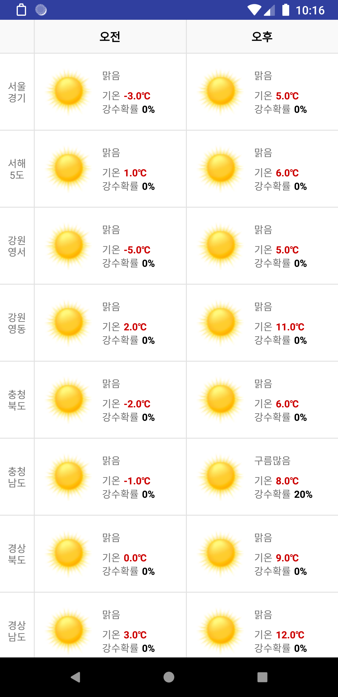
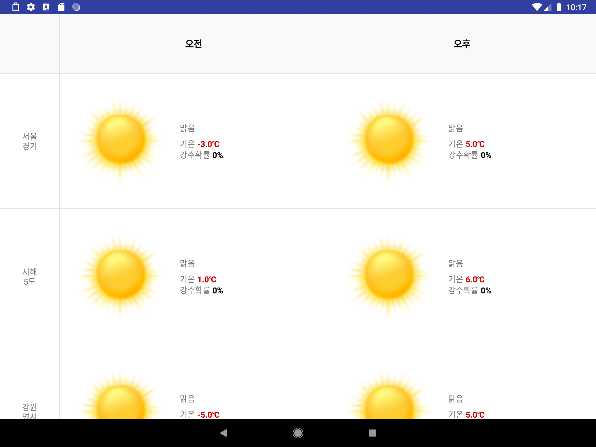

# WeatherSample
It's very simple android application using MVVM Clean Architecture, In this project, we scrape the weather data using `Jsoup`. 

## Tech stack & Open-source libraries
- MVVM
- [Koin](https://github.com/InsertKoinIO/koin)
- [Jsoup](https://github.com/jhy/jsoup)
- [Glide](https://github.com/bumptech/glide)
- [CellAdapter](https://github.com/dongheeleeme/CellAdapter)
